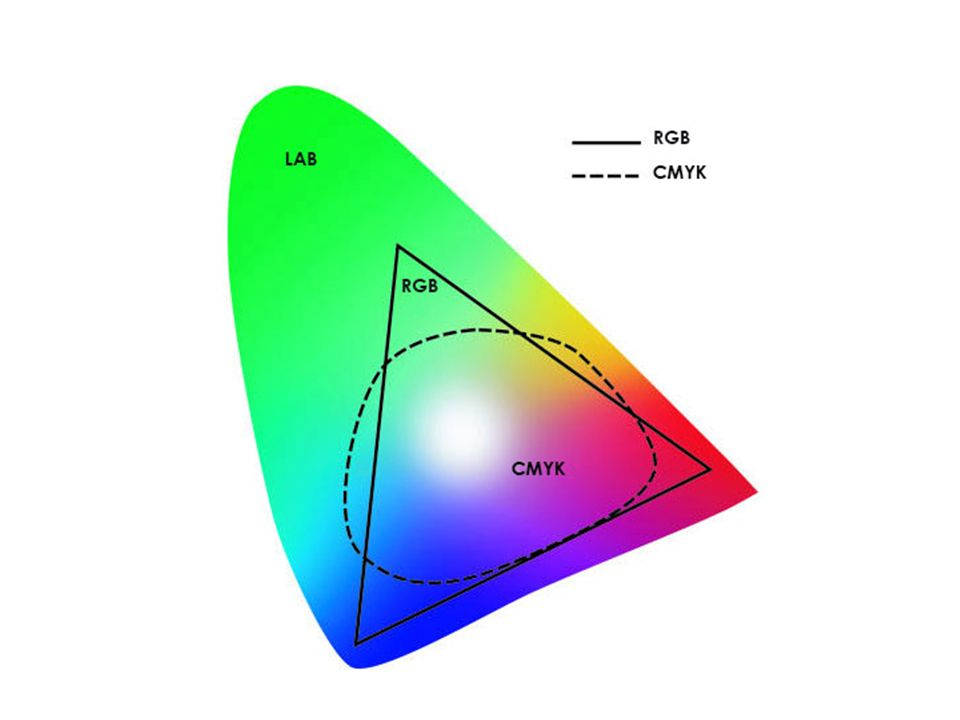

# Dominant Color Extraction using Clustering and Silhouette Method

This repository contains a Python script that utilizes the k-means clustering algorithm and the silhouette method to extract the top dominant colors of an image. The script takes an image file as input and returns the hex code and percentage of the dominant colors in the image.

## Procedure
The given python file performs the following steps on an input image:
1. It reads the input image.
2. It converts the image from the RGB color format to the LAB color format. This is done because the LAB format is more closely aligned with human perception of color, which can improve the accuracy of the subsequent color extraction process.

3. The image is then represented as an array, with each row representing a pixel and each column representing one of the three color values (L, A, and B) of that pixel.
4. If the user does not specify the desired number of colors to extract, the script uses the silhouette method to determine the optimal number of clusters, and therefore the optimal number of colors to extract from the image.
5. The script then applies the k-means clustering method on the pixel array to group similar pixels together.
6. The clusters are then sorted by pixel popularity.
7. The script finds the color each pixel represents by constructing a palette with the mean color of each cluster, and plots the palette.

## Requirements
* Python 3.x
* NumPy
* OpenCV
* Matplotlib
* Scikit-learn
* Scikit-image

## Usage
```bash
python dominant_colors.py -i <image_file> -c <number_of_colors>
The script takes two command line arguments:
```
```bash
-i or --image: path to the image file
-c or --clusters: number of clusters/colors to extract (default is 5)
```

## Example 
```bash
python dominant_colors.py -i image.jpg -c 3
This will extract the top 3 dominant colors of the image 'image.jpg' and display the hex code and percentage of each color.
```

## Note
This algorithm is based on the k-means clustering algorithm and silhouette method, which are sensitive to initial conditions. The results of the algorithm may vary depending on the initial conditions.
